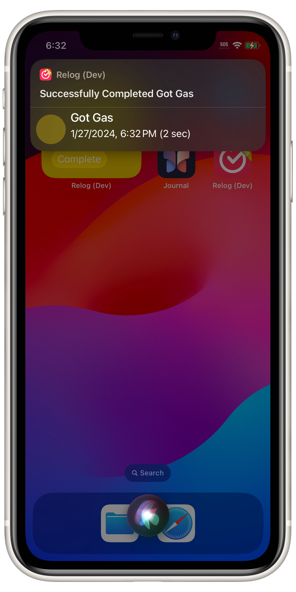

# Relog FAQ

A collection of commonly asked questions about Relog.

If you have a question that isn't answered here, feel free to [reach out](mailto://lonnie@lonniegerol.com).

## Outline
- **General**
	- [Is It Possible to Search for Tasks in Relog?](#is-it-possible-to-search-for-tasks-in-relog)
	- [Can I Import my Data From Other Apps?](#can-i-import-my-data-from-other-apps)
	- [Will You Ever Charge for Relog?](#will-you-ever-charge-for-relog)
	- [Why Can't I Complete the Same Task Within a Few Seconds of the Previous Completion?](#why-cant-i-complete-the-same-task-within-a-few-seconds-of-the-previous-completion)
- **Siri + Shortcuts**
	- [Can I Complete Tasks With Siri?](#can-i-complete-tasks-with-siri)
	- [Why Is the Task Icon Missing in the Confirmation UI When I Complete a Task With Siri?](#why-is-the-task-icon-missing-in-the-confirmation-ui-when-i-complete-a-task-with-siri)
## General

### Is It Possible to Search for Tasks in Relog?

Yep! You can search for tasks but the UI only appears in the Tasks tab if you have **10 or more** tasks.

### Can I Import my Data From Other Apps?

Yep, Relog has shortcuts actions that can help with this and I I even have a few pre-made Shortcuts for commonly requested apps. Please let me know if you run into any issue using them!

If you are using an app that isn't listed here, feel free to reach out and I might add it to this list. I can't promise I'll be able to add support for all requested apps but I'm happy to investigate.

#### Prerequisites

* Enable `Allow Sharing Large Amounts of Data` which can be found in `Settings.App < Shortcuts < Advanced`
* Create an export of any existing data in Relog (`Relog Settings < Manage Your Data < Export Your Data`) 

If the import partially fails, you can clear the data in Relog by navigating to the Settings Tab, scrolling to "Manage Your Data" and selecting "Delete All Data".

| App                                                               | Shortcut                                                                           | Notes                             |
| ---------------------------------------------------------------- | ----------------------------------------------------------------------------------- | --------------------------------- |
| [Last Time](https://apps.apple.com/es/app/last-time/id534982023) | [Shortcuts Link](https://www.icloud.com/shortcuts/2de5bc0ecd944f9e865df172b4dd205e) | Imports all tasks and completions |

If you are a developer of another task logging app, I encourage you do add import from Relog to your app. [I have documented the file format that I use to export data from Relog](https://github.com/Lontronix/Relog-Documentation/blob/main/export-format.md).

### Will You Ever Charge for Relog?

I plan on adding a tip jar in the future, and might charge for future features if they require on-going server costs or take a significant amount of effort to implement. However, any features that currently exist in the app will **never** be put behind a paywall.

My goal is to make sure the fundamentals of Relog are able to be used by everyone.

## Why Can't I Complete the Same Task Within a Few Seconds of the Previous Completion?

In order to prevent accidental completions, tasks have a **5 second cooldown** before they can be completed again. This cool down is present anywhere you complete a task (i.e. in the app, widgets, in a Shortcut or with Siri).

## Siri + Shortcuts

### Can I Complete Tasks With Siri?

You can complete tasks with Siri using two different methods:

#### Say a Predefined Query to Siri

You can say any of these queries:

- `Complete <task name> with Relog`
- `Complete task with Relog`
- `Complete <task name> in Relog`
- `Complete a task in Relog`
- `Log a task in Relog`
- `Log <task name> in Relog`
- `Log a task with Relog`
- `Log <task name> with Relog`

If you don't include a task name in your query, Siri will ask you which task you would like to complete.

The drawback of this method is that you always need to include "Relog" in your query.

*Note: iOS uses on-device machine learning to attempt to match queries that aren't identical to the ones listed above.*

#### Create Your Own Shortcut

If you don't want to always include "Relog" in your query, you can create your own custom shortcut and use either the `Complete Task` or `Complete Task Now` action to complete a task of your choosing. 

The query is whatever you named the shortcut. For instance, I have a Shortcut called "Fed Fishies" that uses the `Complete Task Now` action to complete a task named "Fed  Fishies". Because of that I can just say "Fed Fishies" to Siri and that task will be completed.

### Why Is the Task Icon Missing in the Confirmation UI When I Complete a Task With Siri?

This unfortunately appears to be a limitation in iOS 17 and is not a bug in Relog.

It does not seem to be possible for SwiftUI views to load and display SF Symbols when the App Intent that triggered it was invoked through a query to Siri.

